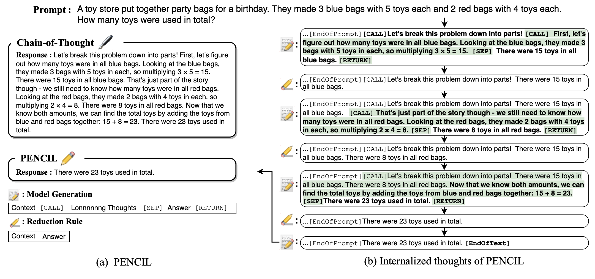

# ✏️ PENCIL: Long Thoughts with Short Memory

This is the official implementation for paper "PENCIL: Long Thoughts with Short Memory". 

PENCIL is a generation paradigm that enables language models to generate very long CoT using a small context window, for solving larger-scale and more complicated reasoning problems. In short, PENCIL incorporates a cleaning mechanism into CoT that periodically and recursively eliminates intermediate thoughts that are no longer needed for generating future thoughts to manage space efficiently. Theoretically, PENCIL with transformer base model can provably solve any computational tasks with optimal time and space efficiency.

Materials: 
[Paper](https://arxiv.org/pdf/2503.14337?)



## Installation

- Install [PyTorch](https://pytorch.org) according to instructions in the offical website.
- Install other required packages via

```bash
pip install -r requirements.txt
```

## Run the Codes

See scripts in the `scripts` folder.

### Datasets Preparation

Create a folder `/data` and prepare datasets by running the following code:

For SAT and QBF

```bash
python dataset_sat.py \
    --num_samples=102000 \
    --train_size=5000 \
    --data_dir=data/${dataset} \
    --min_vars=5 \
    --max_vars=5
```

This script creates a total of `--num_samples` instances that include, by default, 1,000 validation samples and 1,000 test samples (which can be adjusted in the `process_dataset` function). The remaining examples form the training set; note that the training set is split into multiple files, each containing `--train_size` training instances, for large-scale experiments where one file could be very large. 

The `--min_vars` and `--max_vars` aruguments set the minimum and maximum number of variables per instance; if these values are equal, as in our experiments, all instances will have the same number of variables, but if they differ, the dataset will include a mix of instances with varying numbers of variables. 

For Einstein's puzzle

```bash
python einstein_generator.py \
    --num_samples 100000 \
    --data_dir data/${dataset} \
    --size 5 \
    --minimal_conditions \
    --save \

python einstein_solver.py \
    --data_dir data/${dataset} \
    --train_size 5000 \
```

For Einstein's Puzzle, first run `einstein_generator.py` to create a dataset of puzzle instances (with clues and solutions but no reasoning steps). Then, run `einstein_solver.py` to process the generated puzzles, which solves these puzzles and generate the reasoning steps (with special tokens for training the model). 

### Training and Evaluation

For SAT and QBF:

```bash
python train.py \
    config/config_3sat.py \
    --dataset=$dataset \
    --data_dir=data \
    --device=cuda \
    --format=pencil \
```

For Einstein's puzzle

```bash
python train_puzzle.py \
    config/config_puzzle.py \
    --dataset=$dataset \
    --data_dir=data \
    --device=cuda \
    --format=pencil
```

## Citation

If you find our codes useful, please consider citing our work

```bibtex
@misc{yang2025pencil,
      title={PENCIL: Long Thoughts with Short Memory}, 
      author={Chenxiao Yang and Nathan Srebro and David McAllester and Zhiyuan Li},
      year={2025},
      eprint={2503.14337},
      archivePrefix={arXiv},
      primaryClass={cs.LG},
      url={https://arxiv.org/abs/2503.14337}, 
}
```

## Acknowledgement

We thank [nanoGPT](https://github.com/karpathy/nanoGPT) and [Puzzle-Generator-and-Solver](https://github.com/quint-t/Puzzle-Generator-and-Solver) for providing useful implementations.